# Julia

Julia is a simple fractal generator written in C.

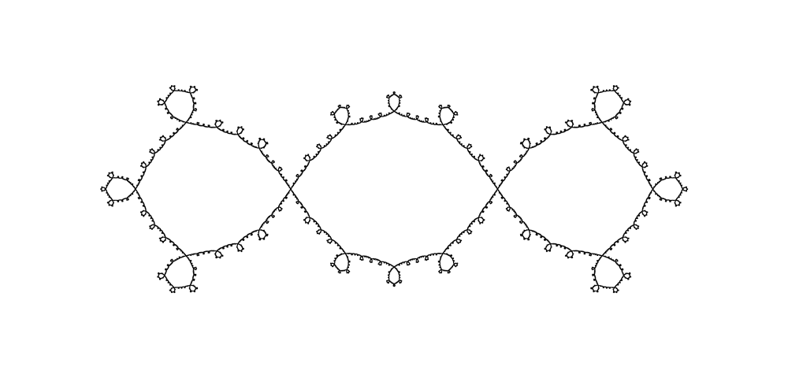

## Building

Just run `make` inside the `src` folder. The program should compile on Linux, Windows, and Mac without problems. The only dependency of this program is the getopt library.

## Usage

Run  `julia [OPTIONS]`. Available options are

  + `-a`, `--algorithm=ALGORITHM`: set drawing algorithm;
  + `-b`, `--bailout=BAILOUT`: set bailout radius to `BAILOUT`;
  + `-c`, `--center=POINT`: set center of the image to `POINT`;
  + `-d`, `--dimensions=DIMENSIONS`: set dimensions of the image to `DIMENSIONS`;
  + `-e`, `--exponent=EXPONENT`: set exponent for computing multibrot;
  + `-f`, `--fractal=FRACTAL`: set fractal;
  + `-h`, `--help`: print help message;
  + `-i`, `--iterations=ITERATIONS`: set the iteration number;
  + `-j`, `--julia=JULIA_CONST`: render Julia fractal with `JULIA_CONST` as a parameter;
  + `-k`, `--kappa=KAPPA`: set `KAPPA` parameter;
  + `-l`, `--load=PATHNAME`: load PPM image from `PATHNAME`;
  + `-o`, `--output=PATHNAME`: set output image path to `PATHNAME`;
  + `-p`, `--palette=PATHNAME`: load palette from `PATHNAME`;
  + `-r`, `--render=OUTSIDE:INSIDE`: set coloring technique to `INSIDE` and `OUTSIDE`;
  + `-z`, `--zoom=ZOOM`: set zoom factor to `ZOOM`;

Parameter `ALGORITHM` can be one of the following numbers:

  0. Escape-time algorithm (default)
  1. Inverse iteration algorithm
  2. Budhabrot algorithm

Parameters `POINT` and `JULIA_CONST` should be given in format `REAL:IMAGINARY`, where `REAL` and `IMAGINARY` are doubles. Parameter `DIMENSIONS` should be given in format `WIDTH:HEIGHT`, where `WIDTH` and `HEIGHT` are unsigned integers. Parameter `EXPONENT` should be double, and parameter `ZOOM` should be positive double

Parameter `FRACTAL` can be one of the following numbers:

  0. Mandelbrot (default)
  1. Multibrot
  2. Mandelbar
  3. Burning ship

Parameter `OUTSIDE` can be one of the following numbers (only for the escape time algorithm):

  0. Plain coloring (default)
  1. Classic coloring
  2. Continuous coloring
  3. Smooth coloring
  4. Argument coloring (only works with low `KAPPA` number)
  5. Continuous argument coloring (only works with low `KAPPA` number)
  6. Grid coloring
  7. Grid image (PPM image must be loaded with the `-l` option)
  8. Distance estimation coloring
  9. Green function coloring
  10. Botcher function coloring
  11. Botcher image coloring (PPM image must be loaded with the `-l` option)

Parameter `INSIDE` can be one of the following numbers (only for the escape time algorithm):

  0. Plain coloring (default)
  1. Rainbow disk coloring (best results are acquired with the lower iteration number)
  2. Inside image coloring (PPM image must be loaded with the `-l` option)
  3. Convergence speed coloring
  4. Argument coloring (best results are acquired with the lower iteration number)
  5. Continuous argument coloring (best results are acquired with the lower iteration number)

Parameter `KAPPA` should be an unsigned integer. It is used as a parameter for different algorithms:
  + if Argument, Continuous argument, Rainbow disk or Inside image coloring is used, `KAPPA` will determine which iteration is used for coloring (default is 5);
  + if Budhabrot or Inverse iteration algorithm is used, `KAPPA` will determine the number of random points used for drawing (default is 10 for IMM, and 100000 for Budhabrot).

See [Examples](#examples) to see how to use options.

### Coloring techniques

For better image quality draw bigger images and then resize them down with some image processing software (eg. Photoshop). The following images marked with :arrow_lower_left: are processed this way. 

Inside rendering techniques:

<table>
  <tr>
    <td>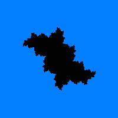</td>
    <td>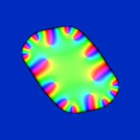</td>
    <td>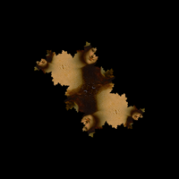</td>
  </tr>
  <tr>
    <td>Plain coloring</td>
    <td>Rainbow disk coloring</td>
    <td>Inside image coloring :arrow_lower_left:</td>
  </tr>
  <tr>
    <td>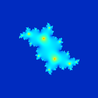</td>
    <td>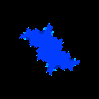</td>
    <td>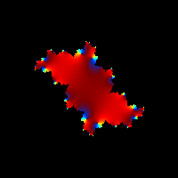</td>
  </tr>
  <tr>
    <td>Convergence speed coloring</td>
    <td>Argument coloring</td>
    <td>Continuous argument coloring</td>
  </tr>
</table>

Outside rendering techniques:

<table>
  <tr>
    <td></td>
    <td>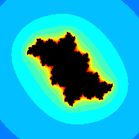</td>
    <td>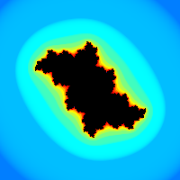</td>
    <td>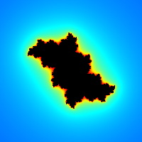</td>
  </tr>
  <tr>
    <td>Plain coloring</td>
    <td>Classic coloring</td>
    <td>Continuous coloring</td>
    <td>Smooth coloring</td>
  </tr>
  <tr>
    <td>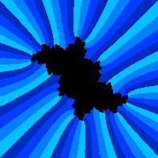</td>
    <td>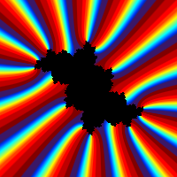</td>
    <td>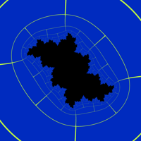</td>
    <td>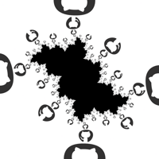</td>
  </tr>
  <tr>
    <td>Argument coloring</td>
    <td>Continuous argument coloring</td>
    <td>Grid coloring :arrow_lower_left:</td>
    <td>Grid image :arrow_lower_left:</td>
  </tr>
  <tr>
    <td>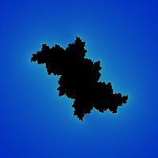</td>
    <td>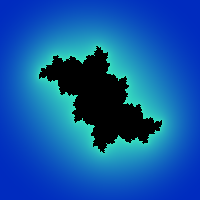</td>
    <td>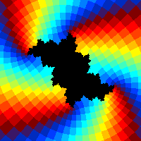</td>
    <td>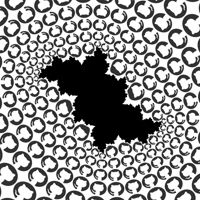</td>
  </tr>
  <tr>
    <td>Distance estimation coloring</td>
    <td>Green function coloring</td>
    <td>Botcher function coloring</td>
    <td>Botcher image coloring :arrow_lower_left:</td>
  </tr>
</table>

### Palettes

Palette file should be a plain text file with a list of colors written in `#RRGGBB` format. Every color should be in a separate line. The first color is used as "inside" color (it will be used for coloring interior of fractals). See some examples in the `palette` folder.

### Examples

``
./julia -f 0 -b 200 -i 100 -d 1000:600 -r 2 -p palette/blue_yellow -z 1.4
``

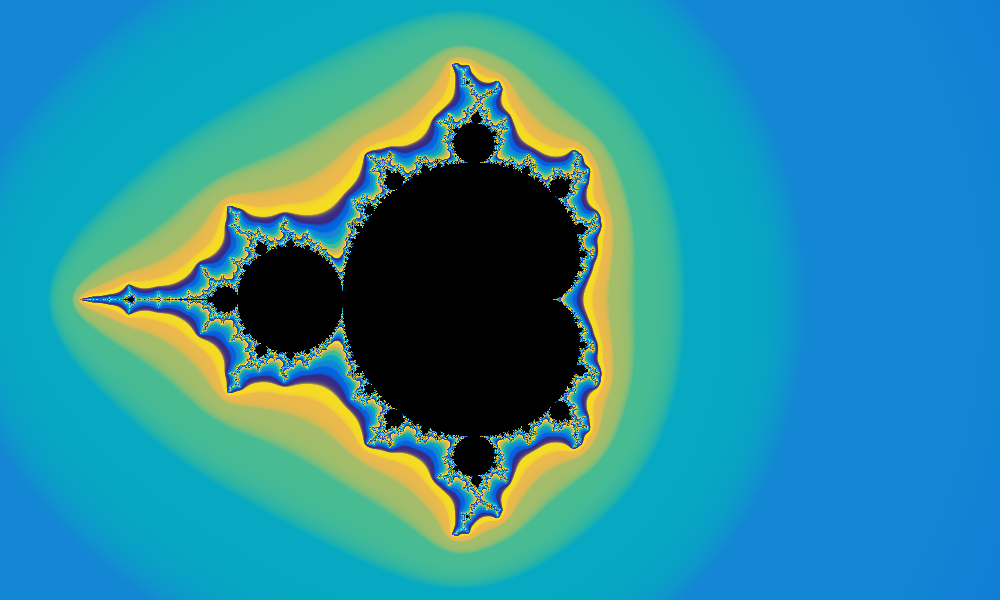

``
./julia -a 1 -j -0.5:0.35 -i 50 -d 1000:600 -z 1.4
``

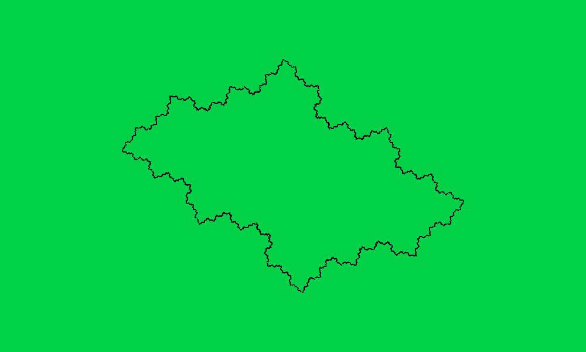

``
./julia -j -0.2:0.3 -r 4:4 -i 50 -b 200 -k 5
``

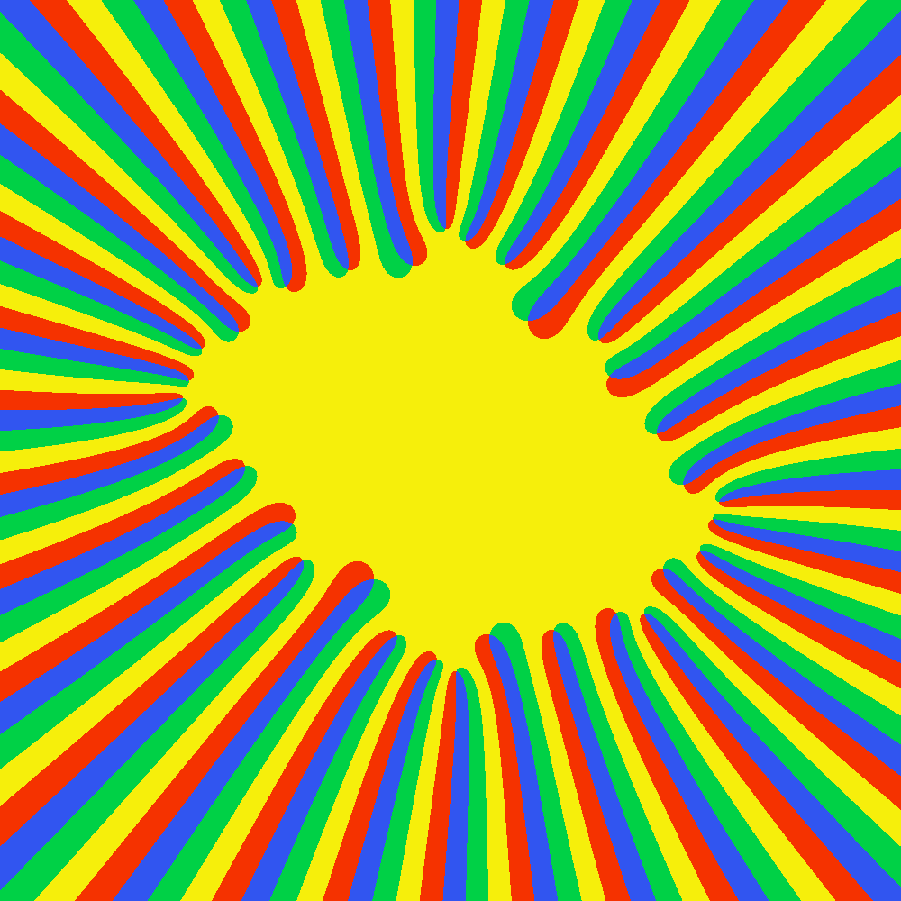

## Credits

The author of this program is [Nikola Ubavić](https://ubavic.rs/?lang=en).

## License

This project is licensed under the MIT License - see the [LICENSE](LICENSE) file for details.
